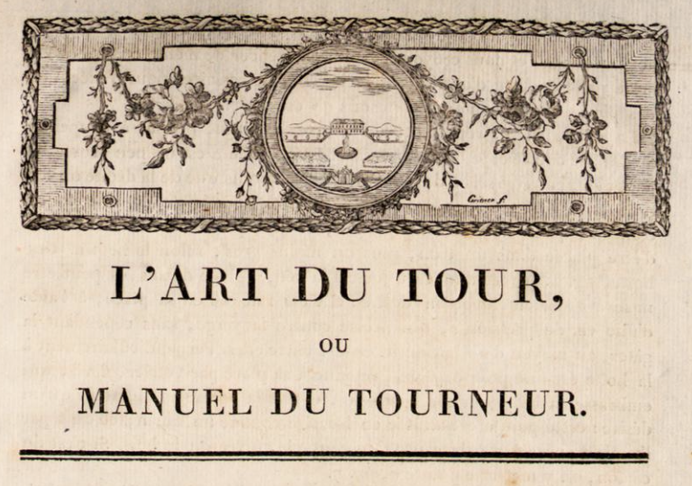

# Bergeron Translation

There is a historic translation of Volume 1 available here [archive.org](https://archive.org/details/turnersmanualbe00berggoog) but pages 9-74 are missing. 

## Phase one
is to translate these from the French original also available here: [archive.org](https://archive.org/details/manueldutourneu00hamegoog)
The OCR scan is not perfect so in order to get a machine translation, first that needs to be cleaned up. 

## Phase two
is to complete the translation of [Volume 2](https://archive.org/details/manueldutourneur02berg_0)

## Phase two
is to arrange the whole thing with all the plates in the right places so it can be printed or viewed as a pdf. Some plates are missing in the historic translation, although all are available separately in the [Atlas du Manuel du Tourneur](https://archive.org/details/manueldutourneurberg)

